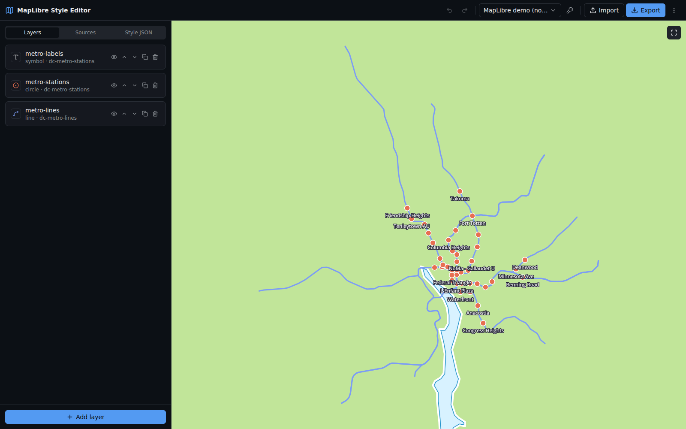
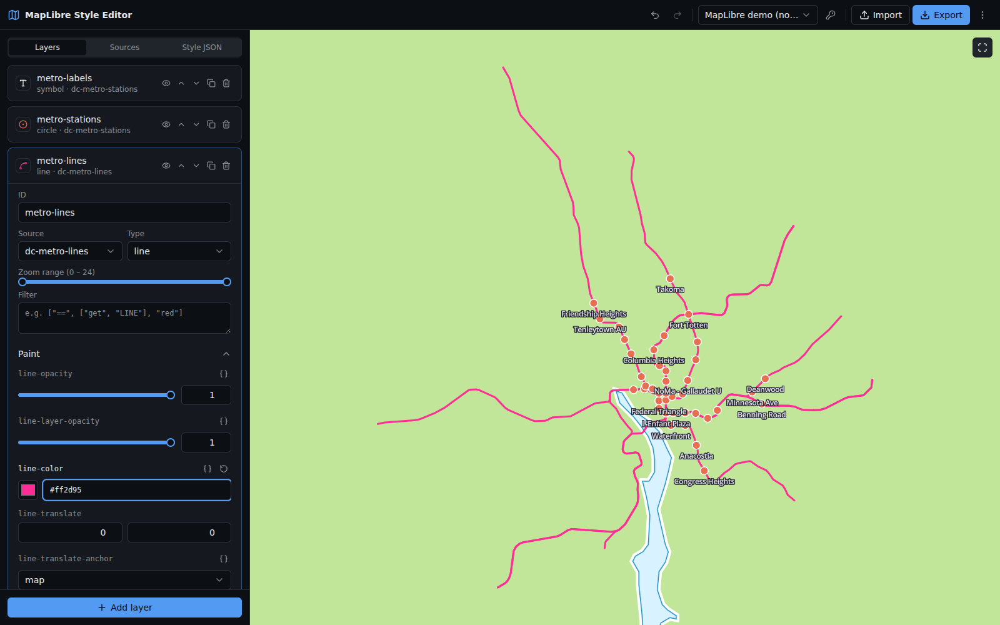

# MapLibre Style Editor

A browser-based editor for quickly styling multi-layer GeoJSON maps and
exporting a ready-to-use MapLibre style document — a mini
[Maputnik](https://maputnik.github.io/) for your own data.

[Open the live editor](https://map.uptonm.dev/)



## What it does

- Edits every paint and layout property of line, fill, circle, symbol,
  heatmap, and fill-extrusion layers — the inputs are generated from the
  official MapLibre style spec, so nothing is missing or out of date.
- Exports the result as a valid `version: 8` style document (with GeoJSON
  inlined or referenced) or as a layers-only snippet, ready to paste into any
  MapLibre or Mapbox GL map. Imports existing style documents too.
- Manages sources: upload, paste, or link GeoJSON, with feature stats and
  cascading deletes.
- Layer management: add, duplicate, rename, reorder, hide, delete; zoom
  ranges, filters, and a JSON expression mode for any property.
- Inspects features on click — property values feed straight into filters
  and `["get", …]` expressions (click a property to copy one).
- Colors layers by data: pick a feature property and get a generated
  `match` palette or `interpolate` ramp expression.
- Drag-and-drop GeoJSON straight onto the map; sources and starter layers
  appear per geometry type.
- Globe projection toggle, pitch/bearing controls, and a zoom scrubber for
  watching interpolation expressions respond.
- Shares the whole style — data included — as a compressed URL.
- Undo/redo (⌘Z / ⇧⌘Z), local-storage persistence, and a live style JSON
  panel.
- Works without any API key on the free MapLibre demo tiles or a blank
  canvas; a MapTiler key (build-time or entered in the UI) unlocks street,
  light/dark, satellite, and outdoor basemaps.



## Built with

- [Bun](https://bun.sh) — runtime, package manager, bundler, dev server, and
  test runner
- React 19, TypeScript, Tailwind CSS 4, Radix UI
- MapLibre GL JS and `@maplibre/maplibre-gl-style-spec`
- zustand + zundo for state, undo/redo, and persistence
- Biome for lint and format

## Run locally

```bash
bun install
bun dev        # dev server with HMR
```

Optionally create `.env.local` for MapTiler basemaps (or just paste a key
into the app's key dialog):

```bash
BUN_PUBLIC_MAPTILER_API_KEY=your_key_here
```

Other commands:

```bash
bun test           # unit tests
bun run check      # typecheck + lint
bun run build      # static production build in dist/
```
