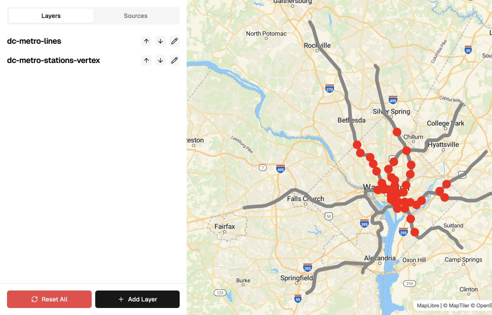
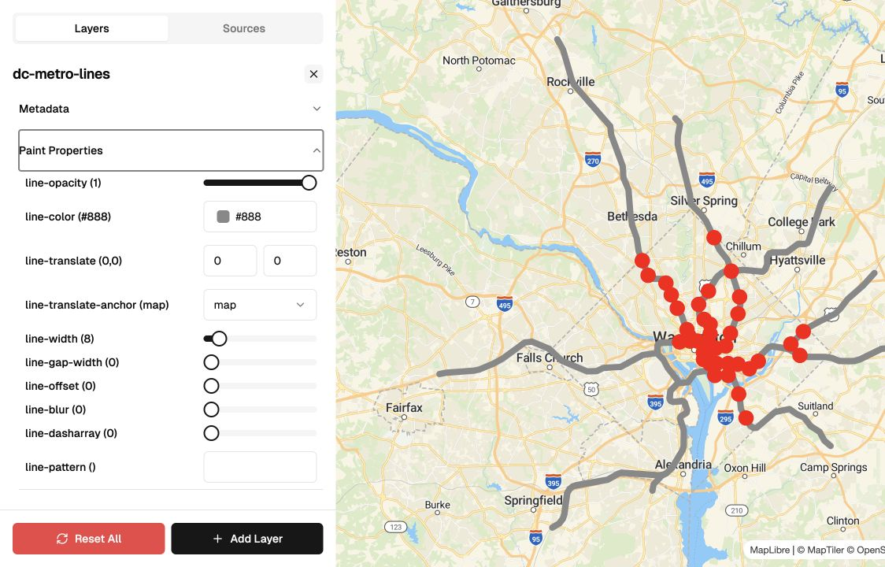

# MapLibre GL Style Editor

A browser-based editor for exploring and changing MapLibre layer styles with a live map preview.

[Open the live editor](https://map.uptonm.dev/)



## What it does

- Updates MapLibre paint, layout, metadata, zoom, and filter properties in real time.
- Supports line, fill, symbol, and circle layers.
- Chooses an appropriate control for each property, including colors, sliders, selects, tuples, text, and expressions.
- Adds, reorders, edits, and resets layers without manually editing a style document.
- Persists the current layer state in local storage between visits.
- Fits the map to the loaded GeoJSON data and ships with Washington, DC Metro data as a working example.



## Current scope

The layer editor is functional and deployed. The Sources panel is still a work in progress; the public demo currently loads the bundled DC Metro GeoJSON sources.

## Built with

- Next.js, React, and TypeScript
- MapLibre GL JS and Turf
- Legend-State for reactive state and local persistence
- Tailwind CSS and Radix UI
- tRPC and TanStack Query

## Run locally

You need a [MapTiler](https://www.maptiler.com/) API key for the basemap.

```bash
pnpm install
```

Create `.env.local`:

```bash
NEXT_PUBLIC_MAPTILER_API_KEY=your_key_here
```

Start the development server:

```bash
pnpm dev
```

Then open [http://localhost:3000](http://localhost:3000).
