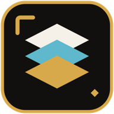

<p align="center">
  
</p>

<h1 align="center"><code>maplibre-gl-style-editor</code></h1>

<p align="center"><strong>Style GeoJSON visually. Export production-ready MapLibre styles.</strong></p>

<p align="center">
  Edit paint, layout, filters, and expressions against a live map.<br>
  Import, share, and export MapLibre style documents entirely in the browser.
</p>

<p align="center">
  <a href="https://map.uptonm.dev">Live editor</a> ·
  <a href="#capabilities">Capabilities</a> ·
  <a href="https://maplibre.org/maplibre-style-spec/">Style specification</a> ·
  <a href="#run-locally">Run locally</a>
</p>

## Try it

Open [map.uptonm.dev](https://map.uptonm.dev) and drop in a GeoJSON file. The
editor creates starter layers for its geometry, then keeps the map, controls,
and exported style in sync.


## Capabilities

| Workflow | What the editor provides |
| --- | --- |
| Sources | Upload, paste, link, or drag in GeoJSON, with statistics for in-browser data and cascading deletes |
| Layers | Add, duplicate, rename, reorder, hide, and remove line, fill, circle, symbol, heatmap, and fill-extrusion layers |
| Styling | Spec-driven controls for paint and layout properties, zoom ranges, filters, and raw JSON expressions |
| Data-driven maps | Generate categorical `match` palettes or numeric `interpolate` ramps from feature properties |
| Inspection | Click a feature to inspect its properties and copy a ready-to-use `["get", …]` expression |
| Map view | Toggle globe projection, adjust pitch and bearing, fit data, and scrub zoom-dependent styles |
| Import and export | Import supported GeoJSON sources and layers; export a complete MapLibre `version: 8` style or layers-only snippet |
| Sharing | Compress the full style state—including data—into a URL for handoff or collaboration |
| Editing | Undo and redo, browser-local persistence, and a live style JSON panel |


The free MapLibre demo tiles and blank canvas need no API key. A MapTiler key
adds street, light, dark, satellite, and outdoor basemaps; a key entered in the
editor stays in that browser's local storage.

## Run locally

```bash
bun install
bun dev
```

To enable MapTiler basemaps at build time, add `.env.local`:

```bash
BUN_PUBLIC_MAPTILER_API_KEY=your_key_here
```

## Development

| Command | Purpose |
| --- | --- |
| `bun dev` | Start the development server with hot reload |
| `bun test` | Run the store, style, sharing, and import/export tests |
| `bun run check` | Type-check the app and run Biome |
| `bun run build` | Create the static production build in `dist/` |
| `bun run preview` | Serve the production build locally |

The app is a Bun-built React 19 SPA using TypeScript, Tailwind CSS, Radix UI,
MapLibre GL JS, Zustand, and the official MapLibre style-spec package.

## Deployment

`bun run build` produces a static app in `dist/`. Production middleware always
reads the fleet gate, so production requires `CLERK_SECRET_KEY`,
`GATES_ORG_ID`, and `GATES_APP_ID=maplibre-gl-style-editor` even when the gate
is unlocked. Configure `NEXT_PUBLIC_CLERK_PUBLISHABLE_KEY` and the optional
Clerk sign-in/sign-up URLs when the deployment can be locked.

## Scope

Only GeoJSON sources and the six layer types listed above are imported. Other
source or layer types are skipped with warnings. Share links store compressed
state in the URL fragment, while editor state and a runtime MapTiler key stay
in browser local storage. Linked GeoJSON and basemap requests still go to their
respective providers, and a build-time MapTiler key is public client
configuration. A non-inline export uses placeholder URLs for in-memory uploads;
replace those URLs before using the style. Large datasets are better handed off
as exported style and GeoJSON files.
